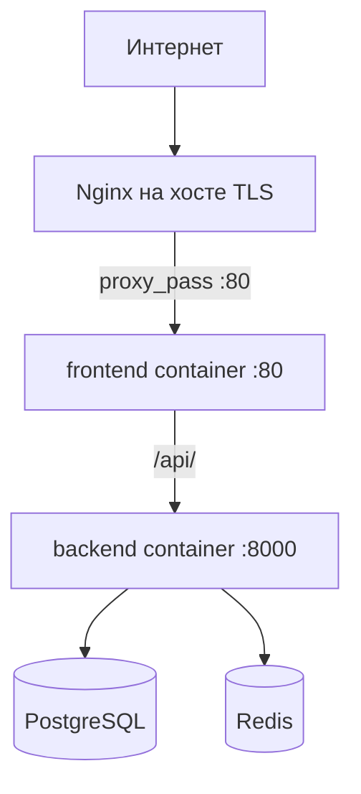

# Руководство администратора (Deployment Guide)

Документ для развёртывания SkillShare Network на боевом сервере (Production): требования к железу, обратный прокси, Docker-стек и действия при сбоях.

Связанные материалы: [PRODUCTION-SECRETS.md](./PRODUCTION-SECRETS.md), [ENV.md](./ENV.md), [GETTING-STARTED.md](./GETTING-STARTED.md).

---

## 1. Требования к серверу

### Минимальная конфигурация (до ~50 одновременных пользователей)

| Параметр | Требование |
| --- | --- |
| ОС | Linux: Ubuntu 22.04/24.04 LTS, Debian 12, или аналог с systemd |
| CPU | 2 vCPU |
| RAM | 4 GB |
| Диск | 40 GB SSD (система + Docker + БД; рост за счёт логов и медиа) |
| Сеть | Исходящий HTTPS для обновлений образов; входящий 80/443 |

### Рекомендуемая конфигурация (production)

| Параметр | Требование |
| --- | --- |
| CPU | 4 vCPU |
| RAM | 8 GB |
| Диск | 80+ GB SSD, отдельный том или раздел для `/var/lib/docker` и данных PostgreSQL |
| Резервное копирование | Ежедневный dump PostgreSQL + копия `.prod-secrets/` в защищённое хранилище |

### Программное обеспечение на хосте

| Компонент | Версия |
| --- | --- |
| Docker Engine | 24+ |
| Docker Compose plugin | v2 |
| (Опционально) Nginx на хосте | 1.24+ — если TLS и домен терминируются не в контейнере |
| (Опционально) certbot | для Let's Encrypt |

---

## 2. Схема развёртывания



**Вариант A (простой):** только `docker-compose.prod.yml` — порт 80 на хосте, TLS на внешнем балансировщике.

**Вариант B (рекомендуется):** Nginx на хосте с SSL → прокси на `127.0.0.1:8080`, где опубликован frontend-контейнер.

---

## 3. Развёртывание через Docker Compose

### 3.1. Подготовка

```bash
git clone <repository-url> /opt/skillshare-network
cd /opt/skillshare-network
```

Создайте секреты — [PRODUCTION-SECRETS.md](./PRODUCTION-SECRETS.md).

### 3.2. Запуск

```bash
docker compose -f docker-compose.prod.yml up -d --build
```

Сервисы:

| Сервис | Роль | Порт наружу |
| --- | --- | --- |
| `db` | PostgreSQL 16 | только internal |
| `redis` | Redis 7 | только internal |
| `backend` | Gunicorn + Uvicorn workers | `expose: 8000` |
| `frontend` | Статика SPA + Nginx → API | `80:80` |

Миграции выполняются при старте backend (через образ/entrypoint при необходимости добавьте `alembic upgrade` в CI/CD).

### 3.3. Публикация на другой порт (для Nginx на хосте)

В `docker-compose.prod.yml` измените mapping frontend:

```yaml
ports:
  - "127.0.0.1:8080:80"
```

---

## 4. Обратный прокси Nginx (на хосте)

Пример для домена `skillshare.example.com` с TLS и проксированием на контейнер frontend (`127.0.0.1:8080`).

Файл: `/etc/nginx/sites-available/skillshare.conf`

```nginx
upstream skillshare_frontend {
    server 127.0.0.1:8080;
    keepalive 16;
}

server {
    listen 80;
    server_name skillshare.example.com;
    return 301 https://$host$request_uri;
}

server {
    listen 443 ssl http2;
    server_name skillshare.example.com;

    ssl_certificate     /etc/letsencrypt/live/skillshare.example.com/fullchain.pem;
    ssl_certificate_key /etc/letsencrypt/live/skillshare.example.com/privkey.pem;

    # Безопасность
    ssl_protocols TLSv1.2 TLSv1.3;
    add_header X-Frame-Options SAMEORIGIN;
    add_header X-Content-Type-Options nosniff;

    client_max_body_size 20M;

    location / {
        proxy_pass         http://skillshare_frontend;
        proxy_http_version 1.1;
        proxy_set_header   Host              $host;
        proxy_set_header   X-Real-IP         $remote_addr;
        proxy_set_header   X-Forwarded-For   $proxy_add_x_forwarded_for;
        proxy_set_header   X-Forwarded-Proto $scheme;
    }

    # WebSocket (если эндпоинт WS включён на backend)
    location /api/ {
        proxy_pass         http://skillshare_frontend;
        proxy_http_version 1.1;
        proxy_set_header   Upgrade           $http_upgrade;
        proxy_set_header   Connection        "upgrade";
        proxy_set_header   Host              $host;
        proxy_read_timeout 3600s;
    }
}
```

Активация:

```bash
sudo ln -s /etc/nginx/sites-available/skillshare.conf /etc/nginx/sites-enabled/
sudo nginx -t && sudo systemctl reload nginx
```

### Nginx внутри frontend-контейнера

Уже настроен в `frontend/nginx.conf`: `/api/` → `http://backend:8000`, остальное — SPA `try_files`.

---

## 5. Apache (альтернатива)

```apache
<VirtualHost *:443>
    ServerName skillshare.example.com
    SSLEngine on
    SSLCertificateFile /etc/letsencrypt/live/skillshare.example.com/fullchain.pem
    SSLCertificateKeyFile /etc/letsencrypt/live/skillshare.example.com/privkey.pem

    ProxyPreserveHost On
    ProxyPass / http://127.0.0.1:8080/
    ProxyPassReverse / http://127.0.0.1:8080/

    RequestHeader set X-Forwarded-Proto "https"
</VirtualHost>
```

---

## 6. Мониторинг и healthcheck

| Проверка | Команда / URL |
| --- | --- |
| API health | `curl -f https://skillshare.example.com/api/v1/health` |
| Контейнеры | `docker compose -f docker-compose.prod.yml ps` |
| Логи backend | `docker compose -f docker-compose.prod.yml logs -f backend` |
| Логи БД | `docker compose -f docker-compose.prod.yml logs -f db` |
| Место на диске | `df -h` и `docker system df` |

---

## 7. Регламент: восстановление после сбоев

### 7.1. Упала база данных PostgreSQL

**Симптомы:** backend отвечает 5xx, в логах `connection refused`, `could not connect to server`, healthcheck `db` — `unhealthy`.

**Действия:**

1. Проверить статус контейнера:
   ```bash
   docker compose -f docker-compose.prod.yml ps db
   docker compose -f docker-compose.prod.yml logs --tail=100 db
   ```
2. Перезапустить только БД:
   ```bash
   docker compose -f docker-compose.prod.yml restart db
   ```
3. Дождаться `healthy`, перезапустить backend:
   ```bash
   docker compose -f docker-compose.prod.yml restart backend
   ```
4. Если контейнер не стартует — проверить том и права:
   ```bash
   docker volume inspect skillshare-network_pg_data
   ```
5. **Восстановление из бэкапа** (если том повреждён):
   ```bash
   docker compose -f docker-compose.prod.yml stop backend
   # восстановить dump в db (пример)
   docker exec -i $(docker compose -f docker-compose.prod.yml ps -q db) \
     psql -U postgres skillshare < /backup/skillshare_YYYYMMDD.sql
   docker compose -f docker-compose.prod.yml start backend
   ```

**Профилактика:** ежедневный `pg_dump`, хранение минимум 7 дней, тест восстановления раз в квартал.

---

### 7.2. Переполнился диск

**Симптомы:** `No space left on device`, Docker не может писать слои, PostgreSQL падает при записи WAL.

**Действия:**

1. Оценить использование:
   ```bash
   df -h
   du -sh /var/lib/docker/*
   docker system df
   ```
2. Очистить неиспользуемые образы и кэш (осторожно на prod):
   ```bash
   docker image prune -f
   docker builder prune -f
   ```
3. Ротировать логи:
   ```bash
   docker compose -f docker-compose.prod.yml logs --no-log-prefix 2>&1 | tail
   # настроить log-driver с max-size в compose при необходимости
   journalctl --vacuum-time=7d
   ```
4. Если переполнен том PostgreSQL — расширить диск / перенести volume, затем `restart db`.
5. После освобождения места — `restart` всех сервисов стека.

**Профилактика:** алерт при использовании диска > 80%, лимиты логов Docker, отдельный раздел для данных.

---

### 7.3. Backend не отвечает (БД жива)

1. `docker compose -f docker-compose.prod.yml logs -f backend`
2. `docker compose -f docker-compose.prod.yml restart backend`
3. Проверить Redis: `docker compose -f docker-compose.prod.yml restart redis`
4. Проверить секреты: файлы в `.prod-secrets/` на месте, права `600`

---

### 7.4. Frontend / Nginx 502

1. Убедиться, что backend healthy: `curl http://127.0.0.1:8080/api/v1/health` (через frontend proxy)
2. `docker compose -f docker-compose.prod.yml restart frontend`
3. Проверить конфиг хостового Nginx: `sudo nginx -t`

---

## 8. Обновление версии

```bash
cd /opt/skillshare-network
git pull
docker compose -f docker-compose.prod.yml build --no-cache
docker compose -f docker-compose.prod.yml up -d
# при новых миграциях — выполнить alembic upgrade в контейнере backend
docker compose -f docker-compose.prod.yml exec backend alembic upgrade head
```

Рекомендуется: бэкап БД перед обновлением, окно обслуживания, откат через предыдущий образ (`docker image ls`).

---

## 9. Безопасность (краткий чеклист)

- [ ] Уникальные секреты в `.prod-secrets/`, не дефолт `change-me`
- [ ] Порт PostgreSQL не опубликован на `0.0.0.0`
- [ ] TLS на внешнем Nginx
- [ ] Firewall: открыты только 80/443 (и SSH по VPN)
- [ ] Регулярные обновления образов `postgres:16-alpine`, `redis:7-alpine`
- [ ] `make security` / CI audit перед релизом
